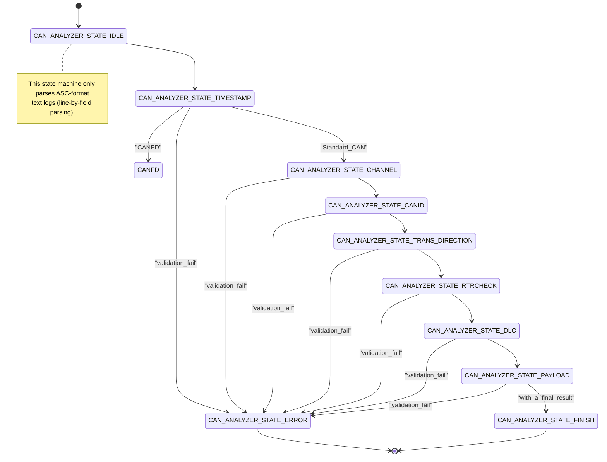

```mermaid
stateDiagram-v2
    [*] --> CAN_ANALYZER_STATE_IDLE

    note right of CAN_ANALYZER_STATE_IDLE
        This state machine only parses ASC-format
        text logs (line-by-field parsing).
    end note

    CAN_ANALYZER_STATE_IDLE --> CAN_ANALYZER_STATE_TIMESTAMP

    CAN_ANALYZER_STATE_TIMESTAMP --> CANFD: "CANFD"
    CAN_ANALYZER_STATE_TIMESTAMP --> CAN_ANALYZER_STATE_CHANNEL: "Standard_CAN"
    CAN_ANALYZER_STATE_TIMESTAMP --> CAN_ANALYZER_STATE_ERROR: "validation_fail"

    CAN_ANALYZER_STATE_CHANNEL --> CAN_ANALYZER_STATE_CANID
    CAN_ANALYZER_STATE_CHANNEL --> CAN_ANALYZER_STATE_ERROR: "validation_fail"

    CAN_ANALYZER_STATE_CANID --> CAN_ANALYZER_STATE_TRANS_DIRECTION
    CAN_ANALYZER_STATE_CANID --> CAN_ANALYZER_STATE_ERROR: "validation_fail"

    CAN_ANALYZER_STATE_TRANS_DIRECTION --> CAN_ANALYZER_STATE_RTRCHECK
    CAN_ANALYZER_STATE_TRANS_DIRECTION --> CAN_ANALYZER_STATE_ERROR: "validation_fail"

    CAN_ANALYZER_STATE_RTRCHECK --> CAN_ANALYZER_STATE_DLC
    CAN_ANALYZER_STATE_RTRCHECK --> CAN_ANALYZER_STATE_ERROR: "validation_fail"

    CAN_ANALYZER_STATE_DLC --> CAN_ANALYZER_STATE_PAYLOAD
    CAN_ANALYZER_STATE_DLC --> CAN_ANALYZER_STATE_ERROR: "validation_fail"

    CAN_ANALYZER_STATE_PAYLOAD --> CAN_ANALYZER_STATE_FINISH: "with_a_final_result"
    CAN_ANALYZER_STATE_PAYLOAD --> CAN_ANALYZER_STATE_ERROR: "validation_fail"

    CAN_ANALYZER_STATE_ERROR --> [*]
    CAN_ANALYZER_STATE_FINISH --> [*]
```
