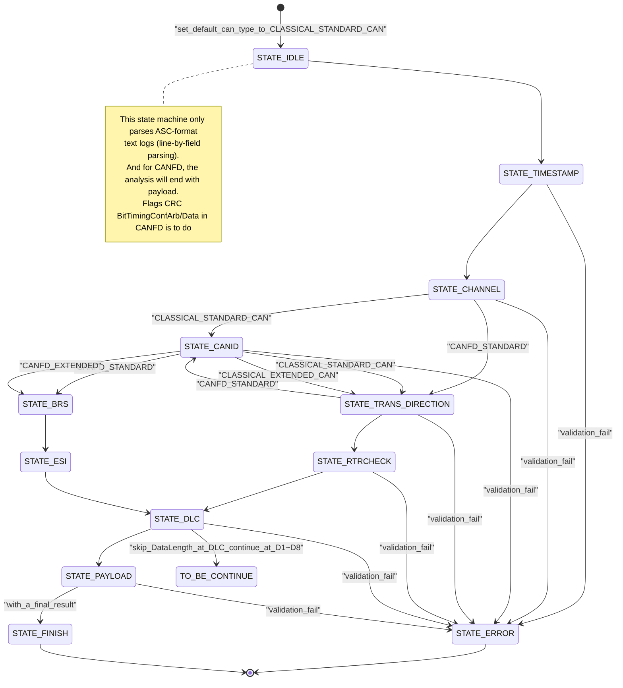

```mermaid
stateDiagram-v2
    [*] --> STATE_IDLE: "set_default_can_type_to_CLASSICAL_STANDARD_CAN"

    note right of STATE_IDLE
        This state machine only parses ASC-format
        text logs (line-by-field parsing).
        And for CANFD, the analysis will end with payload.
        Flags CRC BitTimingConfArb/Data in CANFD is to do
    end note

    STATE_IDLE --> STATE_TIMESTAMP

    STATE_TIMESTAMP --> STATE_CHANNEL
    STATE_TIMESTAMP --> STATE_ERROR: "validation_fail"

    STATE_CHANNEL --> STATE_CANID: "CLASSICAL_STANDARD_CAN"
    STATE_CHANNEL --> STATE_TRANS_DIRECTION: "CANFD_STANDARD"
    STATE_CHANNEL --> STATE_ERROR: "validation_fail"

    STATE_CANID --> STATE_TRANS_DIRECTION: "CLASSICAL_STANDARD_CAN"
    STATE_CANID --> STATE_TRANS_DIRECTION: "CLASSICAL_EXTENDED_CAN"
    STATE_CANID --> STATE_BRS: "CANFD_STANDARD"
    STATE_CANID --> STATE_BRS: "CANFD_EXTENDED"
    STATE_CANID --> STATE_ERROR: "validation_fail"

    STATE_TRANS_DIRECTION --> STATE_RTRCHECK
    STATE_TRANS_DIRECTION --> STATE_ERROR: "validation_fail"
    STATE_TRANS_DIRECTION --> STATE_CANID: "CANFD_STANDARD"

    STATE_RTRCHECK --> STATE_DLC
    STATE_RTRCHECK --> STATE_ERROR: "validation_fail"

    STATE_DLC --> STATE_PAYLOAD
    STATE_DLC --> STATE_ERROR: "validation_fail"
    STATE_DLC --> TO_BE_CONTINUE: "skip_DataLength_at_DLC_continue_at_D1~D8"

    STATE_PAYLOAD --> STATE_FINISH: "with_a_final_result"
    STATE_PAYLOAD --> STATE_ERROR: "validation_fail"

    STATE_BRS --> STATE_ESI

    STATE_ESI --> STATE_DLC

    STATE_ERROR --> [*]
    STATE_FINISH --> [*]
```
